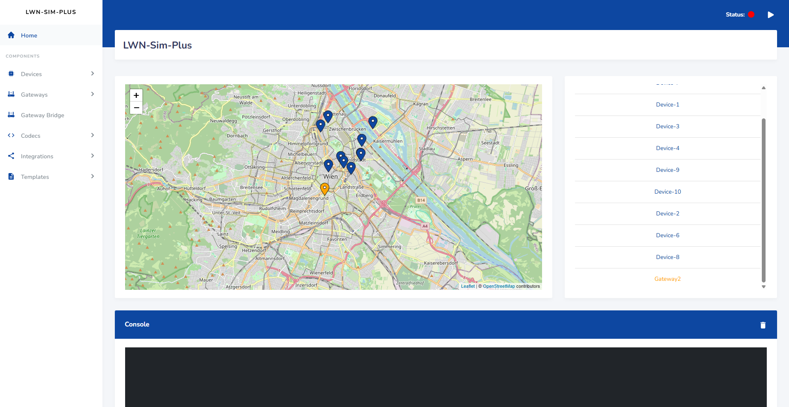

# LWN-Sim-Plus

[](https://github.com/R3DPanda1/LWN-Sim-Plus/blob/main/LICENSE.txt)
[](https://golang.org)

A LoRaWAN device simulator with JavaScript codec support and stateful device simulation.

Forked from [LWN-Simulator](https://github.com/UniCT-ARSLab/LWN-Simulator) with enhancements for dynamic payload generation and production deployment.

## Table of Contents

* [General Info](#general-info)
* [What's New](#whats-new)
* [Requirements](#requirements)
* [Installation](#installation)

## General Info

LWN-Sim-Plus is a LoRaWAN device simulator with web interface. It allows communication with real
LoRaWAN infrastructure or ad-hoc infrastructure such as [ChirpStack](https://www.chirpstack.io/).

## What's New

This fork adds the following features to the original LWN-Simulator:

**JavaScript Codec System**
- Execute ChirpStack-compatible JavaScript codecs for dynamic payload generation
- Built-in helper functions: `getCounter()`, `setState()`, `getPreviousPayload()`, `log()`
- Per-device persistent state management across simulator restarts
- Monaco Editor integration for codec editing with IntelliSense

**Device Profile System**
- Pre-configured templates for real LoRaWAN devices
- REST API endpoints for device and codec management
- WebSocket events for real-time UI updates

**Production Deployment**
- Daemon scripts for background execution (`start.sh`, `stop.sh`)
- JSON-based persistence for devices, gateways, and codecs
- Codec lifecycle validation and usage tracking



The project consists of three main components: devices, forwarder and gateways.

### The device

* Based [specification LoRaWAN v1.0.3](https://lora-alliance.org/resource_hub/lorawan-specification-v1-0-3/);
* Supports
  all [LoRaWAN Regional Parameters v1.0.3](https://lora-alliance.org/resource_hub/lorawan-regional-parameters-v1-0-3reva/).
* Implements class A,C and partially even the B class;
* Implements ADR Algorithm;
* Sends periodically a frame that including some configurable payload;
* Supports MAC Command;
* Implements FPending procedure;
* It is possibile to interact with it in real-time;

### The forwarder

It receives the frames from devices, creates a RXPK object including them within and forwards to gateways.

### The gateway

There are two types of gateway:

* A virtual gateway that communicates with a real gateway bridge (if it exists);
* A real gateway to which datagrams UDP are forwarded.

### JavaScript Codec Example

```javascript
function Encode(fPort, obj) {
    var bytes = [];

    // Access persistent state
    var counter = getCounter("messageCount") || 0;
    setCounter("messageCount", counter + 1);

    // Encode temperature (2 bytes, signed, 0.1°C resolution)
    var temp = Math.round((obj.temperature || 20) * 10);
    bytes.push((temp >> 8) & 0xFF);
    bytes.push(temp & 0xFF);

    return {
        fPort: fPort || 85,
        bytes: bytes
    };
}

function Decode(fPort, bytes) {
    return {
        temperature: (((bytes[0] << 8) | bytes[1]) << 16 >> 16) / 10.0
    };
}
```

## Requirements

* **Go** >= 1.21
* If you don't have a real infrastructure, you can
  download [ChirpStack open-source LoRaWAN® Network Server](https://www.chirpstack.io/project/), or a similar software,
  to test it

> [!TIP]
> A ChirpStack instance can be easily started using Docker. You can find the
> instructions [here](https://www.chirpstack.io/docs/getting-started/docker.html).

## Installation

### From Binary

Download pre-compiled binaries from the [Releases Page](https://github.com/R3DPanda1/LWN-Sim-Plus/releases).

### From Source

Clone the repository:

```bash
git clone https://github.com/R3DPanda1/LWN-Sim-Plus.git
cd LWN-Sim-Plus
```

Install dependencies:

```bash
make install-dep
```

Build the simulator:

```bash
make build
```

The binary will be created in `bin/lwnsimulator`.

Run the simulator:

```bash
./bin/lwnsimulator          # Linux/Mac
./bin/lwnsimulator.exe      # Windows
```

Or run directly with:

```bash
make run
```

> [!NOTE]
> Windows users should install [GnuMake for Windows](https://www.gnu.org/software/make/) to use the makefile.
> With winget: `winget install GnuWin32.Make`

### Configuration file

The simulator depends on a configuration file (`config.json`) which specifies some configurations for the simulator:

```json
{
  "address": "0.0.0.0",
  "port": 8000,
  "metricsPort": 8001,
  "configDirname": "lwnsimulator",
  "autoStart": false,
  "verbose": false
}
```

- `address`: the address where the simulator will listen for incoming connections;
- `port`: the port where the simulator will listen for incoming connections;
- `metricsPort`: the port where the simulator will listen for incoming connections for metrics (Prometheus);
- `configDirname`: the directory where the simulator will store the configuration files;
- `autoStart`: if true, the simulator will start automatically the simulation;
- `verbose`: if true, the simulator will print more logs.

## Tutorials

More coming soon...

### Arabic (thanks to [IdealBit](https://www.youtube.com/@IdealBit365))

[How to Install on Linux or WLS](https://www.youtube.com/watch?v=TEZcyVdanYE)

[How to Install on Windows](https://www.youtube.com/watch?v=BbemBm3Lzvo)

[How to use LWN Simulator with ChirpStack](https://www.youtube.com/watch?v=OpQkb00gfjs)

## Acknowledgments

This project is a fork of [LWN-Simulator](https://github.com/UniCT-ARSLab/LWN-Simulator) by UniCT-ARSLab.

**Key Dependencies:**
- [goja](https://github.com/dop251/goja) - ECMAScript engine for Go
- [ChirpStack](https://www.chirpstack.io/) - LoRaWAN Network Server

## Publications Citing Original LWN-Simulator

- [LWN Simulator-A LoRaWAN Network Simulator](https://ieeexplore.ieee.org/document/10477816)
- [Lightweight Root Key Management Scheme in Smart Grid IoT Network based on Blockchain Technology](https://www.researchsquare.com/article/rs-3330383/v1)
- [Optimizing LoRa for Edge Computing with TinyML Pipeline for Channel Hopping](https://arxiv.org/abs/2412.01609)
- [Compute Continuum in Bioengineering: Enhanced Motion Capture and Real-Time Data Processing on Cloud-Edge Infrastructures](https://tesidottorato.depositolegale.it/handle/20.500.14242/188170)
- [ChirpPark: A Smart and Sustainable Parking System Protocol for Smart Cities and Multi-Agent Vehicles](https://ieeexplore.ieee.org/abstract/document/10697994)
